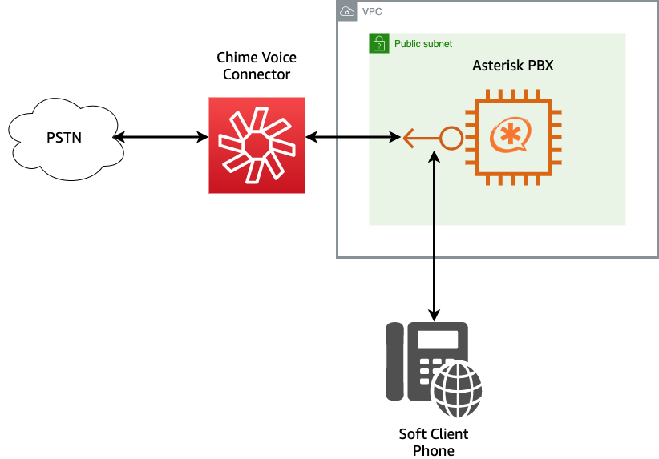
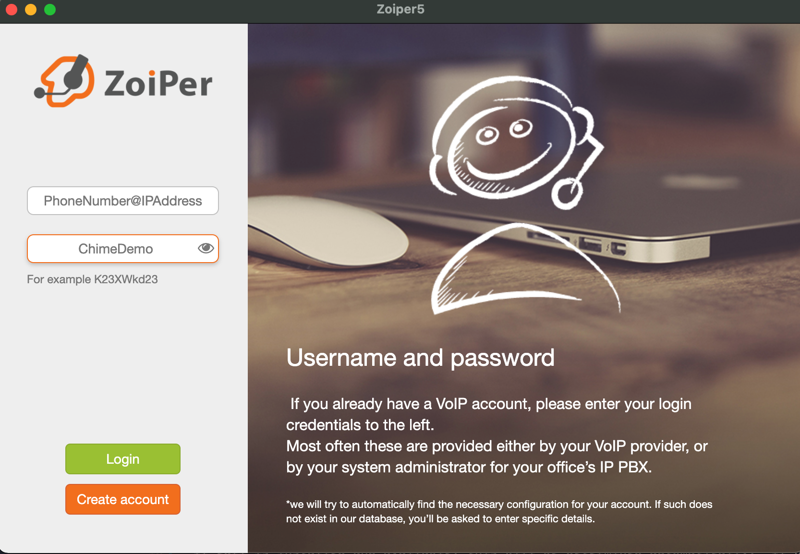
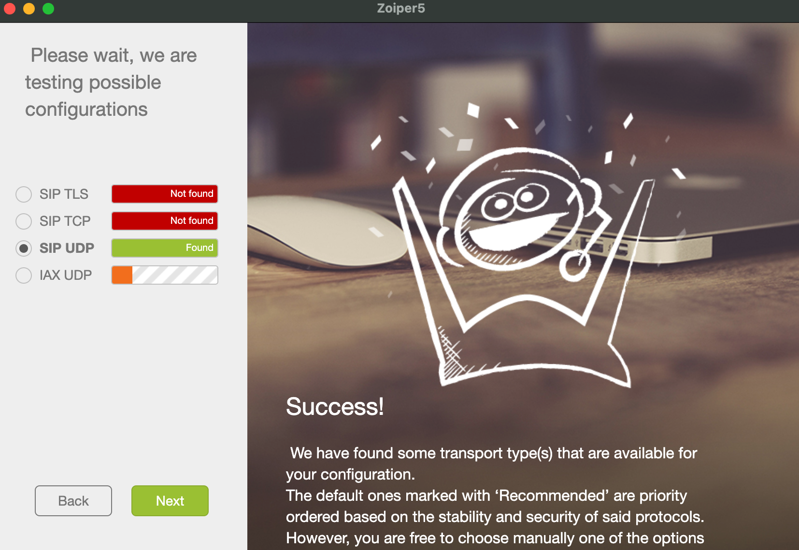

# Chime Voice Connector with Asterisk Demo

This demo will build and configure several services and servers within AWS so that you can make a phone call using Amazon Chime Voice Connector and an Asterisk server hosted in AWS EC2.  
## Overview

## Requirements
- node/npm [installed](https://www.npmjs.com/get-npm)
- AWS CLI [installed](https://docs.aws.amazon.com/cli/latest/userguide/install-cliv2.html)
- AWS CDK [installed](https://docs.aws.amazon.com/cdk/latest/guide/getting_started.html#getting_started_install)
  - `npm install -g aws-cdk`
- AWS CDK [bootstrapped](https://docs.aws.amazon.com/cdk/latest/guide/bootstrapping.html)
  - `cdk bootstrap aws://123456789012/us-east-1`
- Ability to create a VPC and EIP within that VPC (ensure your [Service Quota](https://console.aws.amazon.com/servicequotas/) for EIP is not reached)
- Ability to create a Chime Voice Connector and Phone Numbers (ensure your Service Quota for VC and Phone Numbers have not been reached)
  
## Deployment

- Clone this repo: `git clone git@github.com:aws-samples/building-with-amazon-chime.git`
- `cd building-with-amazon-chime/week-01/`
- `chmod +x deploy.sh`
- `./deploy.sh`

This script will ensure that all dependencies are installed and ready for the CDK deployment.  It will also try to get your external IP address.  This will be used to create a Security Group in the VPC to allow traffic from your network to reach the Asterisk server.  This is similar to a Security Group with 'My IP' selected.

If curl is installed and available, this will be determined automatically.  If not, you will be able to input your external IP address manually.

## Connecting to the Asterisk Server

The output of the CDK will include several commands that you will use to connect to your Asterisk server.  There is no requirement to connect to the Asterisk server, but may be of interest.  

The CDK will create a key-pair and store the private key in AWS SecretsManager.  The DownloadKeyCommand will download this file to your local machine.  The public key of this key-pair has already been loaded in the Asterisk server.  The sshcommand will then ssh to your Asterisk server.  

# Configuring a Client

For this demo, I used [Zoiper](https://www.zoiper.com/) to register to the Asterisk server and make calls.  Zoiper is not required, but examples for configuring it are below.  Another client could be used with similar configurations.

## Login Screen

The PhoneNumber and IPAddress to be used are part of the output and should be copied exactly.  The top box will look like: `+12125551234@192.0.2.23` The password is `ChimeDemo`

The next screen will confirm the hostname of the server to connect to.  This is the IPAddress and should be filled in already.  Skip the Authentication and Outbound Proxy.  

## Success

At this point, a UDP connection should be found and you should see this

## Making A Call

At this point, you should be able to make a call to this number or from this number.  Be sure to dial a full E.164 number when making a call.  It should look like: `+12125551212`.  Try it out!

## Asterisk Basics

From terminal of your EC2 Instance:
| Command | Use  | 
|---|---|
|  `sudo bash`  | Will allow you to operate as root  | 
| `cat /var/log/cloud-init-output.log` | View output of initial install script |
| `systemctl status asterisk`  | Check the status of asterisk  |
| `asterisk -crvvvvv` | Access Asterisk console |

From the Asterisk console:
| Command | Use  | 
|---|---|
| `pjsip show endpoints` | List the pjsip endpoints |
| `pjsip set logger on` | Enable pjsip logging |
| `core reload` | Reload the configuration files |

Key Asterisk Config Files in the `/etc/asterisk` directory:
| File | Function |
| ----| --- |
| pjsip.conf | Configuration of endpoints |
| extensions.conf | Configuration of call routing |

# Destroying This Install

To clean up after you're done with this demo, you can run `cdk destroy`.  This will remove most of the components that were created, but you will need to remove the Voice Connector and Phone Number associated manually within the AWS [Chime Console](https://console.chime.aws.amazon.com/).

