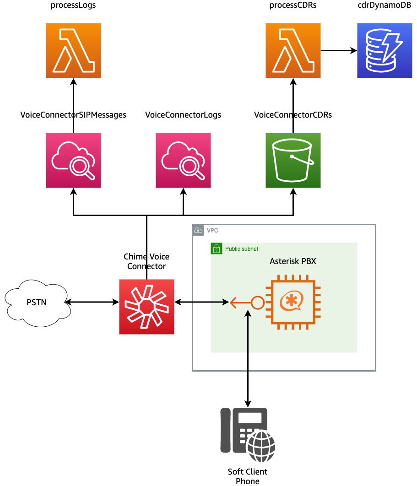

# Chime Voice Connector CDR Analysis and Metadata Parsing

This demo will build and configure several services to explore CDR analysis and metadata parsing from SIP INVITEs using VoIP on AWS.

## Requirements
- AWS CLI [installed](https://docs.aws.amazon.com/cli/latest/userguide/install-cliv2-linux.html)
- node/npm [installed](https://github.com/nodesource/distributions/blob/master/README.md)
- AWS CDK [installed](https://docs.aws.amazon.com/cdk/latest/guide/getting_started.html) and [bootstrapped](https://docs.aws.amazon.com/cdk/latest/guide/bootstrapping.html)
- Ability to create a VPC and EIP within that VPC (ensure your [Service Quota](https://console.aws.amazon.com/servicequotas/) for EIP is not reached)
- Ability to create a Chime Voice Connector (ensure your Service Quota for VC is not reached)
## Deployment

- Clone this repo
- `chmod +x deploy.sh`
- `./deploy.sh`

This script will ensure that all dependencies are installed and ready for the CDK deployment.  If you get a schema related error, please uninstall and re-install aws-cdk to get to the latest version.  
```
npm uninstall -g aws-cdk
npm install -g aws-cdk
```

## Making a Call

Please see the directions outlined in [Week-01](https://github.com/aws-samples/building-with-amazon-chime/tree/main/week-01#configuring-a-client) for configuring the client and placing a call.  An outbound call from the Asterisk to a PSTN phone will be required to see the results of the parsing function.

## Overview




## Functions

Two Lambda functions are used in this demo.  The process_cdrs.js function will trigger on updates to the S3 bucket used by Amazon Chime Voice Connector.  This bucket is created as part of the CDK deployment and assocaited in the global settings in the Amazon Chime console.  When new CDRs are generated, they will be put in the S3 bucket in JSON format.  This will trigger the Lambda to run and process the contents, look up the cost of this call, and store the results in a Dynamo DB.

The second function operates in a similar fashion.  SIP message logs have been enabled for this Voice Connector.  When a call is placed and SIP messages are generated, these messages will be stored in a CloudWatch log group associated with the Voice Connector.  A CloudWatc subscription filter has been enabled that will send logs that contain "INVITE sip" to the Lambda.  This lambda will then parse the log and look for a specific header.  

In this case, the Asterisk has been configured with: 
```
[HeaderSupport]
exten => addheader,1,Set(PJSIP_HEADER(add,X-Header-Support)=${UNIQUEID})

[outbound_phone]
exten => _+X.,1,NoOP(Outbound Normal)
same => n,Dial(PJSIP/${EXTEN}@VoiceConnector,20,b(HeaderSupport^addheader^1))
same => n,Congestion
```

This will cause the INVITE sent from the Asterisk to add an X-Header with a unique value.  

When this INVITE is captured in the CloudWatch logs, the process_log.py Lambda will parse the log looking for `X-Header-Support` with the following code:

```
        sip_message = str(x['message'])
        x_header_start = sip_message.find('X-Header-Support')
        if not x_header_start == -1:
            x_header = sip_message[(x_header_start+18):(x_header_start+30)]
            print("X-Header: " + x_header)
```
This lambda is just capturing the output in the logs of the Lambda, but this data could be used in many other AWS services.

# Destroying This Install

To clean up after you're done with this demo, you can run `cdk destroy`.  This will remove most of the components that were created, but you will need to remove the Voice Connector and Phone Number associated manually within the AWS [Chime Console](https://console.chime.aws.amazon.com/).  Additionally, the S3 bucket created to store the CDRs will need to be emptied and deleted.